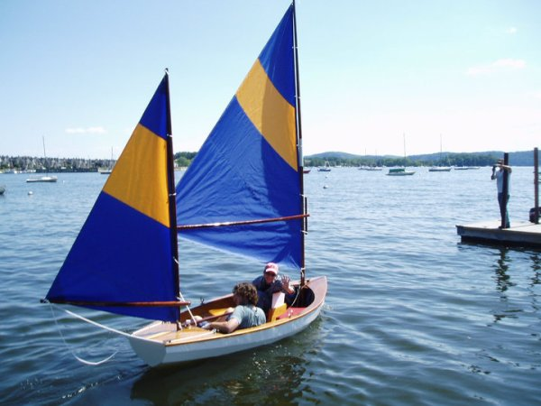

Alex Gates is currently an Assistant Professor in the School of Data Science at the University of Virginia.  He has developed a multi-faceted research program exploring how connectivity shapes careers with applications to scientists, artists, and non-profit leaders & organizations.

Alex's research philosophy is grounded in systems theory: he conceptualizes collective human behavior as emerging from the non-trivial behavior and relationships of individuals---individuals are not equally exchangeable; rather, they have unique history-dependent skills and knowledge, they interact in teams, are embedded in complex networks of relationships, and they move between organizations stimulating the diffusion of ideas, policies, and practices within society. His work explores the performance and success empowering careers, and the influence of strategic decisions made by the managers and administrators who support them.

I use he/him pronouns; they/them pronouns work just fine, too.

I’ve also built my own sailboat, loving named **A Little Character**:
